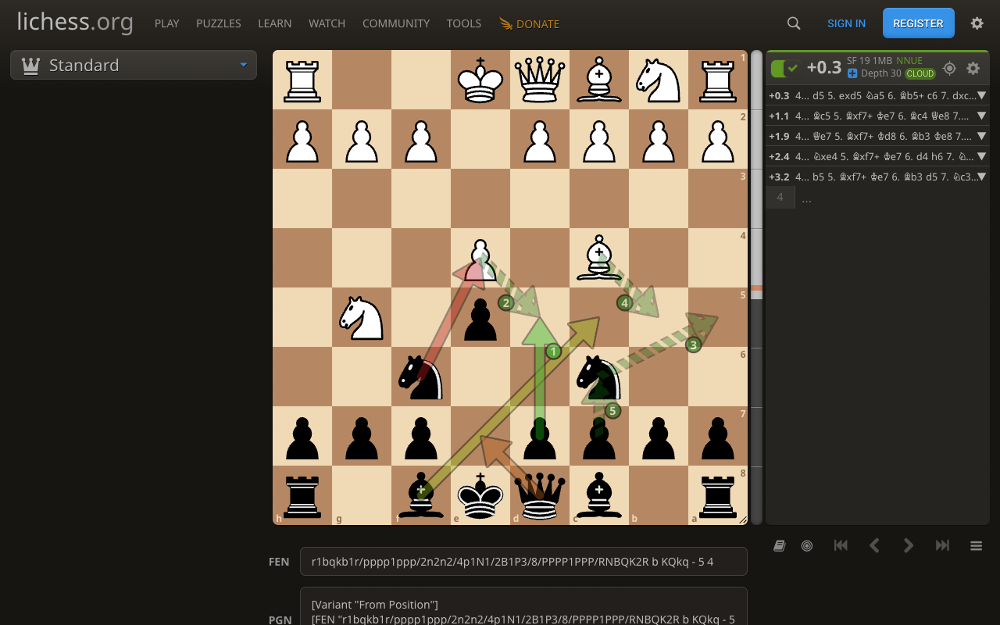
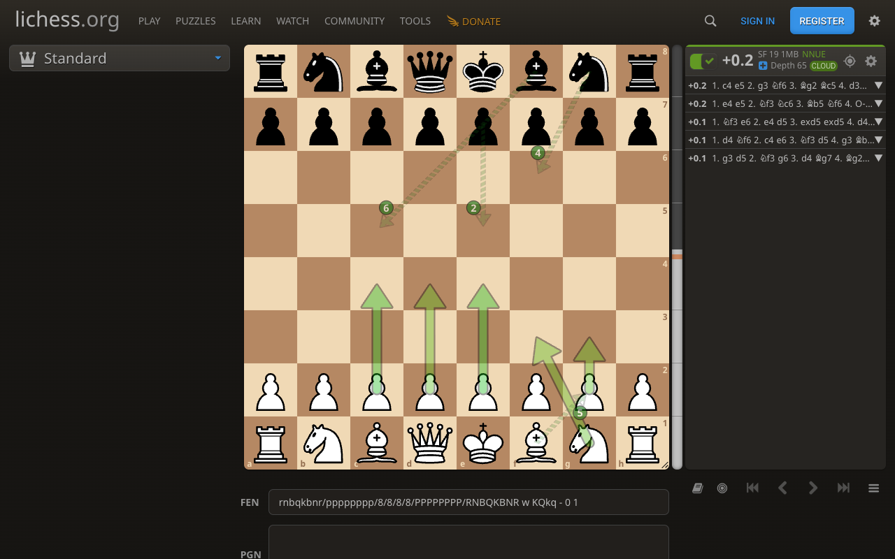

# Lichess Arrow Colors

A small Chrome extension (Manifest V3) that colour-codes the engine suggestion
arrows on [lichess.org](https://lichess.org), so you can tell the best line
from the alternatives at a glance.



Black to move. The engine's best move is green, and the arrows shade through
yellow and orange to red as the moves get worse. The striped green arrows are
the rest of the best line, which lichess does not draw at all.

Lichess draws the best line in pale blue and every other multi-PV line in the
same pale grey, so with 3 to 5 lines enabled you cannot tell which grey arrow
is second best. This extension fixes that.

Lichess also draws weaker moves as thinner arrows. Colour already says how good
a move is, so every arrow is drawn at the same width, and thinner than lichess's
own. There is a width slider on the options page, and you can switch the whole
thing off to get lichess's widths back.

When every move is about equally good, nothing turns red:



## Two colouring modes

**By how good the move is (default).** Each arrow is shaded on a green to red
gradient by how much its line gives up against the engine's best line. The
measure is lichess's own winning-chances curve, taken from the mover's point of
view, so the same eval gap shades the same way for both colours and mate scores
rank above any centipawn score.

By default the gradient is stretched across the moves on the board, so the best
move is green and the weakest arrow shown is red whatever the gap between them.
This is what makes a forced mate stand out from a merely winning alternative,
since both sit near the flat end of the winning-chances curve. To stop a
position where every move is equal from being blown up into a full green to red
spread, the stretch has a floor: differences smaller than 0.05 winning chances
leave every arrow green.

Turning the stretch off puts colour on a fixed scale instead, where an arrow
only reddens when the line is clearly worse than the best one.

**By engine line rank.** The older fixed palette, one colour per multi-PV slot:

| Rank | Default colour |
|------|----------------|
| 1 (best line) | green `#22c55e` |
| 2 | yellow `#eab308` |
| 3 | orange `#f97316` |
| 4 | red `#ef4444` |
| 5 and below | grey `#9ca3af` |

Pick a mode on the options page. Rank colours are editable there; the gradient
is fixed.

## Outlines

Arrows are outlined in black by default, which keeps them legible over pieces
and over both light and dark squares. The outline is the same thickness the
whole way round, including the arrowhead, and adding it does not change the
size of the arrow itself. Its colour and thickness are adjustable. Turn it off on the
options page if you prefer lichess's plain arrows.

## The rest of the best line

Lichess draws one arrow per engine line, for its first move only. This draws
the moves after it as well, in a darker shade of the same green, so you can
see where the best line is going and not just how it starts.

Every move of the line is numbered, lichess's own arrow included: it is move
1, the one after it 2, then 3, and so on. Numbering the first move as well is
what makes the rest read as a line rather than as a set of extras starting at
2, and its numeral is drawn in its own brighter colour, so the number says
which move it belongs to as plainly as the arrow does. It appears only once
there is a move after it to number; on a board where the line is not drawn
past its first move, a lone 1 would say nothing.

The number is a small disc set beside the arrow, just behind its head and
always on the same side of the way it points. Beside rather than on it keeps
the arrow itself clear, and behind the head rather than on the destination
square keeps two moves arriving at the same square from different directions
from stacking their numbers on top of each other.

The arrows are as wide as any other, outline and arrowhead included, and drawn
at four fifths of a regular arrow's opacity, which keeps the move you actually
have to play the strongest thing on the board without making the rest of the
line something you have to look for. The stripes and the darker shade already
say whose arrows these are, so there is nothing a thinner line would add.

How strongly they are drawn has its own slider on the options page, from a
tenth of a regular arrow up to the full strength of one. The numbers themselves are drawn solid, and
over every arrow on the board, since a number you cannot read is not worth
drawing: a faded one takes on whatever it happens to lie over, and one buried
under a crossing arrow is not there at all.

Both sides' moves are drawn, since a line only makes sense with the replies in
it. Four moves past the first are drawn by default, numbered 2 to 5; the
slider on the options page goes up to eight, and zero turns the whole thing
off.

Point at any line in the engine panel and the board follows it. Lichess
already clears the other arrows and draws the line you are pointing at on its
own; the moves after it are drawn and numbered the same way, so you can read
a line off the panel and see it on the board without playing it out. The line
keeps its own colour while you do, so a losing line is still red as you walk
through it. Move the pointer away and the board goes back to all five.

These arrows are finely striped, since they are the one thing on the board
lichess did not put there: a solid arrow is always a move an engine line
starts with, and a striped one is always a move further down the best line.
The stripes are cut on the diagonal, which reads as deliberate at a glance
where a square cut looks like an arrow that failed to draw. The arrowhead is
striped on the same rhythm and the same lean, so the whole arrow reads as cut
from one striped material, and it stays square to the arrow so the direction
still reads.

A move whose arrow is already on the board is not drawn twice. So a line that
shuffles a piece back and forth keeps only its first, brightest arrow, and a
continuation that happens to also be another line's first move is left in that
line's own colour rather than being drawn over. It still carries its number,
though, beside the arrow that is there: the numbers run 1, 2, 3 without a hole
in them whether or not the extension had to draw the arrow itself, and a move
the line plays twice is numbered twice, the second numeral sitting a disc
further back along the shaft.

## Overlapping arrows

Arrows are drawn longest first, so where two cross, the shorter one lies on
top. A long arrow still reads from the length of shaft either side of the
crossing; a one-square arrow buried under it does not.

## Install

1. Clone or download this folder.
2. Open `chrome://extensions`, enable **Developer mode**.
3. Click **Load unpacked** and pick this folder.
4. Open any lichess analysis board, turn the engine on, and set
   **Multiple lines** to 2 or more in the engine settings (gear icon).

Colours and opacity can be changed from the extension's options page
(right-click the extension icon, then **Options**). Changes apply live.

The extension collects no data. See [PRIVACY.md](PRIVACY.md).

## How it works

- Lichess's board library (chessground) tags every arrow group with a
  `cgHash` attribute containing origin square, destination square, brush name
  and line width. The engine's best line uses the `paleBlue` brush, the other
  lines use `paleGrey`.
- The engine panel lists lines in rank order, each row carrying its first move
  in `data-uci` and its evaluation in a `strong` element. Evaluations are shown
  from white's point of view, so they are flipped when black is to move.
- The content script matches each arrow's move to a row, works out the colour
  for that line, and swaps the arrow's stroke and arrowhead marker. A
  `MutationObserver` re-runs this whenever the board or the engine panel
  changes.
- When a row's evaluation is not shown (lichess hides it with a single engine
  line), the arrow's line width is used instead, since lichess derives that
  width from the same quantity.
- Lichess draws the line under the pointer as the *best* arrow, clearing the
  others, so which line to follow is readable off the board itself: the row
  whose first move carries the best brush. The extension watches for that
  rather than for the pointer, which means no hover state to keep in sync, no
  listener to tear down, and the right behaviour whenever something else makes
  lichess single a line out. It falls back to the first row when no row owns
  the arrow.
- Lichess gives every move of a line its own `.pv-san` element carrying
  `fen|uci` for the board it previews on hover, so the whole line is
  readable from the engine panel. The moves past the first are arrows the
  extension creates: lichess never draws them.
- Placing a new arrow needs the board's geometry, which the extension measures
  off an arrow lichess has already drawn rather than hardcoding chessground's
  numbers. That arrow's `cgHash` names its squares and its `x1`/`y1` say where
  the first of them sits, which also settles which way round the board is; the
  gap between the arrow's drawn length and the true distance between the two
  squares is the room chessground leaves for the arrowhead.
- chessground removes any shape group whose `cgHash` it does not recognise, so
  the added arrows go whenever it redraws the board. They are put back by the
  same pass that recolours everything else, which the `MutationObserver` runs
  on that very redraw.
- The arrowhead is a `marker`, so its stripes are drawn in marker units, where
  one unit is the line's stroke width. That is the same measure the shaft's
  stripes are sized in, so a fixed 1.5 units to a stripe and its gap keeps the
  two in step at any width. The stripes run past the head on both sides and are
  clipped to its outline.
- A leaning band travels sideways as it crosses the head -- 25 degrees over a
  head four units tall carries it almost two units along -- so the bands have
  to be generated well outside the head on both sides: one that starts past its
  point still crosses it lower down. Generating only the bands that start
  within the head left its back corner and its point bare, and the head read as
  a chevron rather than an arrow. The phase is kept in whole periods from the
  back edge, so the first gap still falls where the shaft's last stripe ends.
- A striped head means its outline marker is drawn unfilled: the outline is
  wanted, but a filled black head underneath would show through the stripes'
  gaps instead of the board. That marker is otherwise identical to the filled
  one lichess's own arrows use, now that both are drawn at the same width, so
  the marker's id carries which of the two it is.
- The numerals are drawn as their own groups rather than inside the arrows',
  because opacity on a group applies to everything in it and both the added
  arrows and lichess's own are deliberately faded. In the longest-first ordering they count as
  shorter than a circle, so they sort after every shape on the board and
  nothing can be painted over them.
- The colour is the best move's own, taken down in lightness: an `hsl()` from
  the gradient loses lightness directly, a hex colour from the rank palette
  has its channels dimmed. Both stay recognisably the same green.
- The added arrows are striped with a `stroke-dasharray` sized so that a whole
  number of stripes spans the shaft: about one stripe per arrow width, then
  stretched to fit exactly. A fixed dash would instead cut a stripe off
  partway wherever the arrowhead happened to fall, which reads as an arrow
  that failed to draw. The outline is cloned from the arrow and picks the
  stripes up with it, which leaves the gaps clear instead of showing a solid
  black bar through them.
- Each arrow is cut in two where the arrowhead's back edge falls, which
  chessground puts `refX` stroke widths back from the line's end. The shaft
  takes the stripes and the shear; the piece the head covers carries the
  marker. Both are cut square at the ends, since a round cap on the head's
  piece bulges out past the arrowhead's outline as a pair of dark ears.
- Dashes always cut square across a line, so the diagonal comes from shearing
  the shaft along its own direction, sliding each point sideways in proportion
  to how far off the arrow's axis it lies. Points on the axis stay put, and so
  does the distance off it, so the arrow keeps its place, its length and its
  width, and only the stripe ends lean over. It is written as a `matrix` and
  not as `rotate`/`skewX`/`rotate`: SVG's `skewX` shears about the origin, and
  composing it with rotations about the arrow's start still shears about a
  point the arrow's own distance away, which slides the whole shaft along
  itself by as much as two thirds of a square.
- Widths come from a per-line modifier in the same `cgHash`. The extension
  reads and stores lichess's original width, then draws every arrow at the
  chosen width. Widths are in chessground's unit, a 64th of a square.
- An arrow drawn in several pieces paints each piece whole -- its outline, then
  its body -- before starting the next, rather than laying every outline down
  first. It matters where the shaft meets the head: the shear slides the last
  stripe along the arrow by half a width, so it overshoots the head's back edge
  on one side, and with the outlines all underneath, that overshooting stripe
  painted over the head's own outline and bit a notch out of its back corner.
- The outline is a wider copy of the arrow drawn underneath it, which gives the
  shaft an even edge. The arrowhead needs more care: chessground scales the head
  with the line's stroke width, so a wider copy would inflate the head rather
  than outline it, leaving its sides and back several times thicker than the
  shaft's edge. The outline instead draws the head at exactly the arrow's size
  and strokes it, half the stroke falling outside the edge, with round joins so
  even the sharp tip is offset by the same amount. The arrow's own size never
  changes.
- Arrows are faded through their group rather than per line. Fading each line
  on its own would let the outline show through the arrow body and muddy the
  colour.
- An SVG paints in document order, so the arrow lichess lists last covers the
  ones it crosses. The extension reorders the arrow groups longest first,
  leaving short arrows on top. chessground diffs its shapes by `cgHash` rather
  than by position, so moving the groups does not disturb it.
- Threat-mode arrows (red), hand-drawn arrows and variation arrows are not
  touched.

## Development

```bash
npm test          # unit tests for the pure ranking logic (node --test)
npm run icons     # regenerate icons/*.png
```

`src/logic.js` is dependency-free and runs both in the browser and under Node.
`src/content.js` holds the DOM glue. Nothing needs building.
