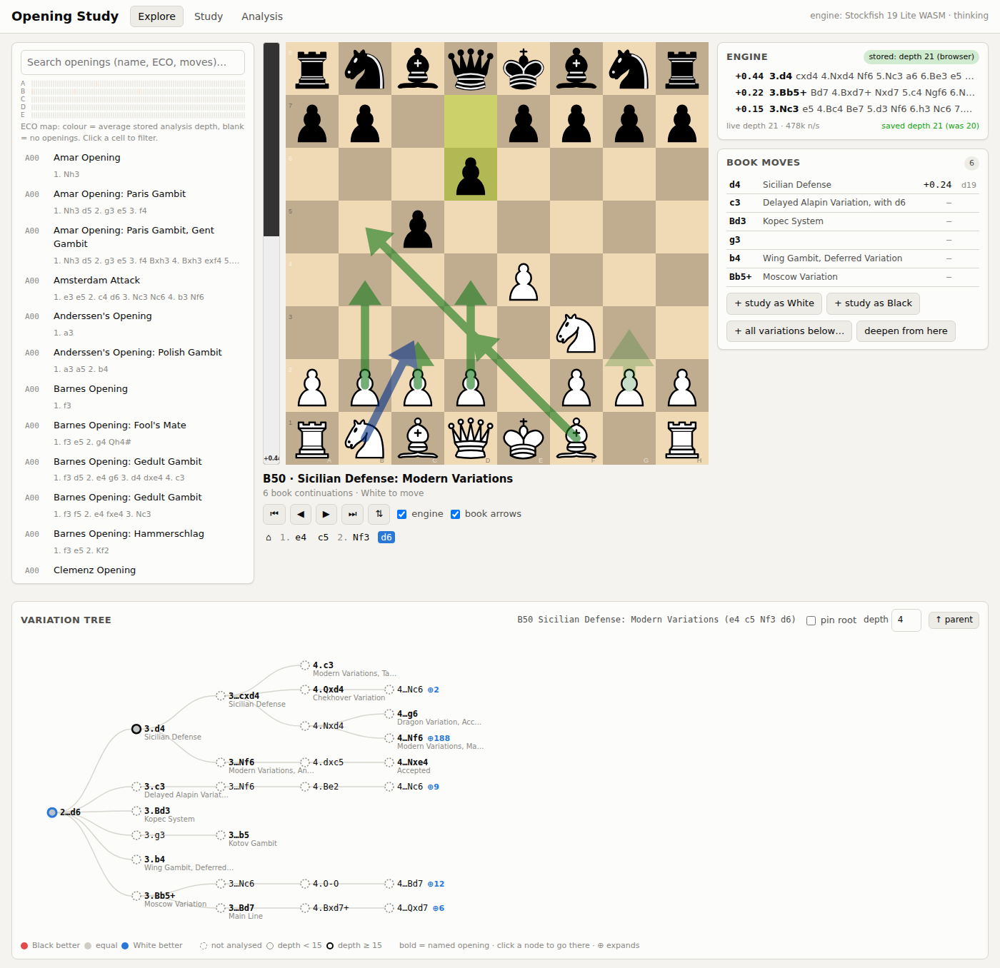

# Chess Opening Study

A self-hosted web app for exploring chess openings, drilling the variations
you choose, and building up an engine analysis of the whole opening book that
gets deeper the longer you run it.



## What it does

**Explore.** The full [lichess opening book](https://github.com/lichess-org/chess-openings)
(3,800 named openings, ECO A00 to E99) is loaded as a move tree. Search by
name, ECO code or moves, or click a cell in the ECO map. On the board every
book continuation is drawn as an arrow, listed with its stored engine
evaluation, and the variation tree below the board shows the lines that
branch out from the current position, coloured by evaluation. Click any node
to jump there; play any move on the board to leave the book and analyse on
your own.

**Study.** Add any line to the study set, to be played as White or as Black.
Drill mode plays the opponent's moves and waits for yours; one wrong move
fails the line for that round, and the expected move is shown as a hint.
Results feed a simple Leitner schedule (boxes with intervals of 1, 3, 7, 14,
30 and 60 days) so "Drill due" always gives you the lines you are most likely
to have forgotten. "All variations below…" adds every named line under a
position in one go.

**Engine analysis.** Stockfish 19 (WASM) runs in a Web Worker in the browser
and analyses whatever position is on the board, three lines at a time. Every
result that is deeper than what the server has stored is saved, so the
analysis you see is never shallower than the last time anyone looked at that
position.

**Stored, improving analysis.** Analysis lives in a SQLite database keyed by
position, so transpositions share it and nothing is ever overwritten by a
shallower result. Two things keep deepening it:

* The **server deepener** runs the same Stockfish build in Node and walks the
  book, shallowest positions first, until every position in scope reaches
  the target depth. Raise the target depth and it carries on from where it
  is. The scope can be the whole book or everything under one position, and
  "deepen from here" pushes the current variation to the front of the queue.
  It resumes automatically when the server restarts.
* Any browser tab can opt in to **also deepen**: a second engine worker pulls
  the shallowest positions from the server and pushes deeper results back.

The Analysis tab shows how much of the book is covered, the depth histogram
and the deepener's progress, and exports everything as JSON.

## Running it

Requires Node.js 22.5 or newer (for the built-in SQLite module).

```sh
npm install
npm start
# open http://127.0.0.1:3000
```

Environment variables:

| Variable | Default | Meaning |
|---|---|---|
| `PORT` | `3000` | HTTP port |
| `HOST` | `127.0.0.1` | Bind address (set `0.0.0.0` to reach it from another machine) |
| `DB_PATH` | `data/study.sqlite` | Where analysis and the study set are stored |
| `DEEPEN` | unset | `1` starts the server deepener on boot |
| `STOCKFISH_FLAVOR` | `lite-single` | Server engine build: `lite-single`, `lite`, `single`, `full` (the full nets are 94 MB and stronger) |
| `LOG_DEEPEN` | unset | `1` logs every position the deepener finishes |

Headless deepening without the web server, for example on a machine that is
left running overnight (it shares the database with the server):

```sh
npm run deepen -- --depth 24 --multipv 3 --scope "e4 c5"
```

Refresh the vendored opening book from lichess:

```sh
npm run fetch-openings
```

Tests:

```sh
npm test
```

## How it fits together

```
data/openings.tsv      lichess chess-openings (CC0), vendored
shared/book.js         TSV -> move trie; used by server and browser
shared/uci.js          UCI parsing, per-multipv accumulator, score helpers
shared/fen.js          EPD keys (FEN without move counters)
server/openings.js     loads the book, computes the position of every node
server/db.js           SQLite: analysis, study_lines, settings
server/engine.js       Stockfish in Node with analyse(fen, {depth, multipv})
server/deepener.js     background queue that raises stored depth
server/app.js          static files + JSON API
public/                the page: board (chessground), engine worker, tree, drill
```

### API

| Method | Path | Purpose |
|---|---|---|
| GET | `/api/openings` | the book as `{eco, name, pgn, san[]}` |
| GET | `/api/analysis?epd=` | stored analysis for a position |
| POST | `/api/analysis` | `{epd, depth, lines[]}` – stored only if deeper than what exists |
| POST | `/api/analysis/batch` | `{epds[]}` -> map of stored analysis |
| GET | `/api/analysis/stats` | counts, depth histogram, book coverage |
| GET | `/api/analysis/export` | everything, as JSON |
| GET | `/api/eco` | per-ECO-code coverage for the map |
| GET/POST | `/api/deepen`, `/start`, `/stop`, `/configure`, `/prioritize`, `/next` | server deepener |
| GET/POST/DELETE | `/api/study`, `/api/study/:id`, `/api/study/:id/result` | study set and drill results |

Positions are keyed by EPD (the first four FEN fields). Scores are stored as
the engine reports them, from the side to move's point of view; the UI
converts to White's point of view for display.

## Licences

This project is released under the GNU GPL v3 or later (see `LICENSE`)
because it is built on GPL components: the engine is
[Stockfish.js](https://github.com/nmrugg/stockfish.js) (GPL-3.0) and the
board is [chessground](https://github.com/lichess-org/chessground)
(GPL-3.0-or-later). Move generation uses [chess.js](https://github.com/jhlywa/chess.js)
(BSD-2-Clause). The opening book is the lichess
[chess-openings](https://github.com/lichess-org/chess-openings) data (CC0).
